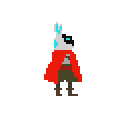
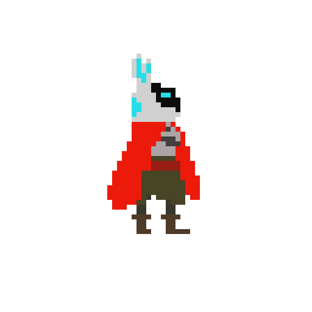

Multitier architecture
===================

This game is a literal representation of [Multitier architecture](https://en.wikipedia.org/wiki/Multitier_architecture), a type of client–server architecture.

You play as a user request send by the user, and must hack your way through.

Made for [GitHub Game Off 2016](https://github.com/github/game-off-2016)

###Controls
Keyboard: ASDW or arrows to move. Z to jump, X to shoot and C to change weapon.
Joystick: A to jump, X to shoot and Y to change weapon.
Down to interact.

----------
##Building and stuff
This game was made with Unity 5.3.4f1 personal edition. The game can be built with unity's same version, or, you can download the game already builded from the *build.zip*.

You can also download the game from [ it's Itch.io site](https://javyer.itch.io/multitier-architecture).

The whole game was programmed trying to follow the multitier architecture, so there is a lot of abstraction between different stuff. This proved more useful than annoying (I thought that it would be difficult, but I actually love this way of coding, it's so simple to replace stuff!).

There are lots of Data Transfer Objects, even the character is setted up that way. I thought of making the game three times longer but I ran out of time, the idea was to configure through a DTO the new character controller of every level. Although if I want to retake it in the future is coded in such a way that wouldn't prove to many difficulties to understand the code again.

Also, another detail, there is not a single rigidbody in the whole game. I took as a challenge to write up my own physics. In the beginning I hated it, but then I understood a lot more than before.

#### A little glitch
There are a couple of glitches or typos. Sometimes you get stucked to a wall, jump to release.

Credits
-------------

Most of the art and all of the design/programming was made by [me](https://github.com/Bullrich).

The other part of the art was made by Yamila Diaz.

Music was borrowed (with permision) from [Baddas Wolf Shirt](https://badasswolfshirt.bandcamp.com/).